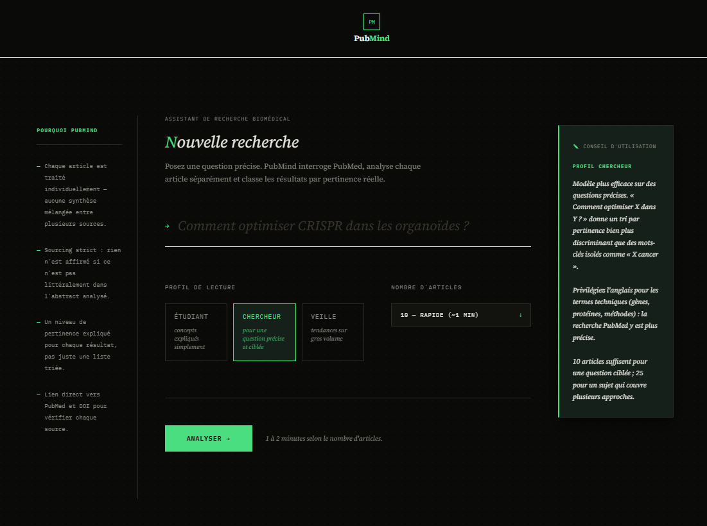
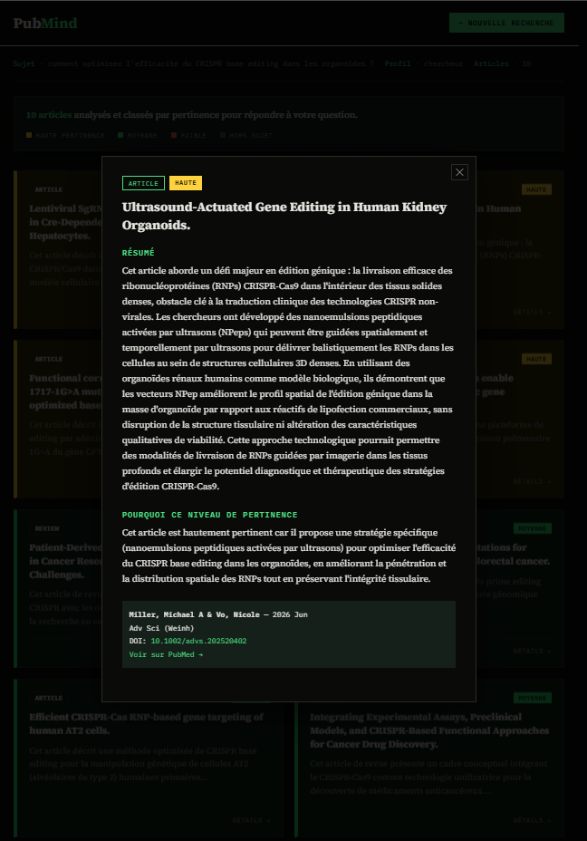
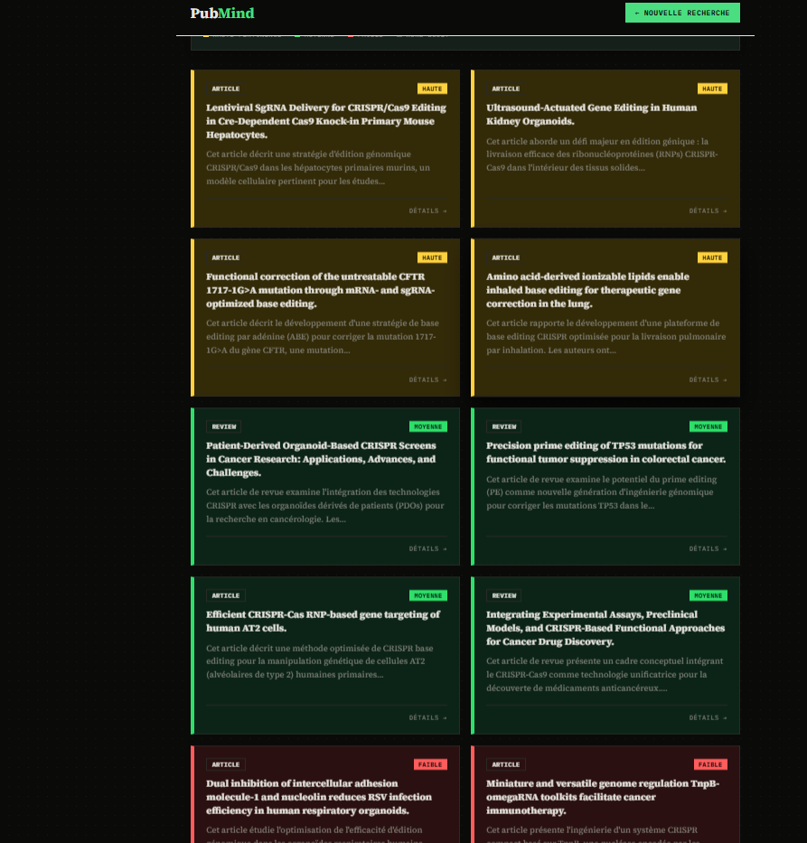
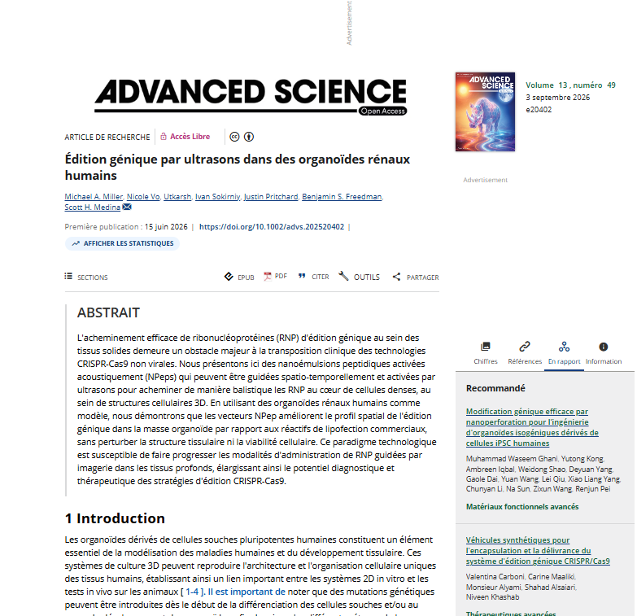
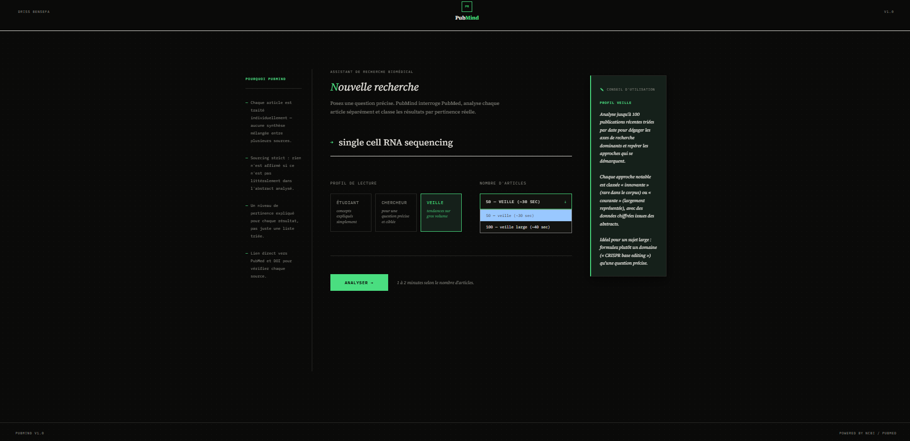

# PubMind

**Un outil de synthèse de littérature biomédicale conçu pour ne jamais inventer.**

PubMind interroge PubMed, analyse les articles scientifiques avec l'API Claude, et produit des synthèses dont chaque affirmation est traçable jusqu'à sa source. Le sourcing strict n'est pas une option : c'est la contrainte centrale autour de laquelle toute l'architecture est construite.



---

## Le problème

Les outils de synthèse basés sur des LLM ont un défaut structurel : quand une information manque dans la source, le modèle comble le vide avec des connaissances générales plausibles mais non vérifiables. Pour un chercheur, une méthode ou un chiffre inventé — même juste dans l'absolu — rend l'outil inutilisable, parce qu'il faut tout revérifier.

PubMind est construit pour rendre ce comportement structurellement impossible, pas pour le corriger après coup.

---

## Comment la fiabilité est garantie

**Séparation stricte entre données factuelles et interprétation.** Les métadonnées (titre, auteurs, journal, année, DOI, type de publication) sont extraites en Python directement depuis le format MEDLINE de PubMed. Le modèle ne les génère jamais — il ne peut donc pas les altérer.

**Une carte = un article.** Sur le profil Chercheur, chaque appel au modèle ne traite qu'un seul abstract. L'agrégation entre sources est mécaniquement impossible, ce qui élimine les attributions floues du type « plusieurs études montrent que… » sans savoir lesquelles.

**Périmètre de génération explicite.** Le prompt interdit toute donnée absente de l'abstract fourni. Les champs qui ne peuvent pas être garantis (protocoles détaillés, matériel expérimental) ont été retirés du produit après vérification manuelle contre les articles sources.

**Vérification empirique.** Les résultats ont été contrôlés en ouvrant les DOI et en comparant les chiffres générés aux abstracts réels. Les cas où le modèle sortait du périmètre ont été identifiés et corrigés au niveau de l'architecture — pas seulement au niveau du prompt.

---

## Les profils

### Chercheur — répondre à une question précise

Pour une question ciblée (« comment optimiser CRISPR dans les organoïdes intestinaux ? »).

- Recherche PubMed triée par pertinence
- Un appel Claude par article, indépendant des autres
- Chaque carte : type de publication, titre, résumé fidèle à l'abstract, résultats chiffrés extraits littéralement, niveau de pertinence justifié
- Tri automatique par pertinence (haute / moyenne / faible / hors sujet), avec code couleur
- Lien direct vers PubMed et DOI pour vérification



Chaque carte s'ouvre sur le détail complet — résumé, résultats clés, justification de la pertinence, et les métadonnées vérifiables (auteurs, journal, DOI, lien PubMed direct vers l'article source).



Le lien DOI de chaque carte mène directement à l'article réel — la meilleure façon de vérifier soi-même que le résumé généré correspond bien à la source.



### Veille — se mettre à jour sur un domaine

Pour un sujet large (« CRISPR base editing », « single cell RNA sequencing »).

- Recherche PubMed triée par date de publication (les plus récents d'abord)
- Jusqu'à 100 articles analysés en un seul appel optimisé
- Synthèse narrative structurée en sections thématiques adaptées au corpus
- Dynamique temporelle du domaine (accélération, stabilisation, ralentissement)
- Auteurs récurrents identifiés à partir des métadonnées réelles
- Points actionnables en conclusion (« Ce qu'il faut retenir »)
- Articles notables classés « innovant » (approche rare dans le corpus) ou « courant » (approche représentative) — classification basée sur la fréquence observée, pas sur un jugement subjectif
- Mise en page à deux colonnes : synthèse à gauche, articles notables à droite, visibles simultanément pendant la lecture



### Étudiant — explications simplifiées

Pour explorer un sujet sans prérequis technique poussé : concepts vulgarisés, gènes et protéines expliqués en langage simple, techniques définies, avec un lien systématique vers l'article source.

---

## Architecture technique

```
Sujet utilisateur
   ↓  extraire_mots_cles()        → mots-clés scientifiques en anglais
   ↓  rechercher_articles()       → identifiants PubMed (tri pertinence ou date)
   ↓  telecharger_articles()      → MEDLINE brut
   ↓  parser_articles()           → liste de dictionnaires structurés
   ↓  synthese_article()          → une carte par article        [Chercheur]
      synthese_veille()           → synthèse globale du corpus    [Veille]
      synthese_ia()                → contenu pédagogique Markdown  [Étudiant]
   ↓  liaison métadonnées         → chaque sortie reliée à sa source réelle
   ↓  rendu Jinja2 (+ conversion Markdown → HTML pour le profil Étudiant)
```

**`parser_articles()`** est le cœur de la fiabilité : un parser MEDLINE écrit à la main qui extrait huit champs par article (PMID, titre multi-lignes, type de publication, année, journal, auteurs, DOI, abstract), en gérant les cas particuliers du format — champs sur plusieurs lignes, identifiants multiples (`[doi]` vs `[pii]`), abstracts absents.

L'écran de chargement affiche une estimation réaliste du temps d'attente plutôt qu'une fausse promesse de rapidité.


---

## Stack

- **Python 3.11**
- **Flask** — serveur web et rendu des templates
- **Biopython (Entrez)** — accès à l'API NCBI/PubMed
- **API Claude (Haiku)** — analyse et synthèse
- **Jinja2, HTML/CSS/JS, Markdown** — interface et rendu du profil Étudiant

Interface sombre avec typographie Source Serif 4 et IBM Plex Mono, animations d'entrée, code couleur cohérent entre les profils.

---

## Installation

```bash
git clone https://github.com/Driss-Bensefa/pubmind.git
cd pubmind

conda create -n bioagent python=3.11
conda activate bioagent

pip install -r requirements.txt
```

Configurer la clé API Anthropic en variable d'environnement :

```bash
setx ANTHROPIC_API_KEY "votre_cle"    # Windows
export ANTHROPIC_API_KEY="votre_cle"  # macOS / Linux
```

Lancer :

```bash
python app.py
```

Puis ouvrir `http://localhost:5000`.

> **Note sur les versions** : le SDK `anthropic` 1.0.0 (août 2026) a supprimé le paramètre `temperature` des méthodes `Messages`. Le `requirements.txt` fixe une version compatible — ne pas l'installer sans contrainte de version.

---

## Performance

| Profil | Articles | Temps observé |
|---|---|---|
| Chercheur | 10 | ~50 s |
| Chercheur | 25 | ~2 min |
| Veille | 50 | ~35 s |
| Veille | 100 | ~40 s |

Le profil Chercheur fait un appel par article (précision maximale, temps proportionnel au volume). Le profil Veille traite l'ensemble du corpus en un appel, ce qui le rend plus rapide malgré un volume bien supérieur.

---

## Limites connues

- L'analyse porte sur les **abstracts**, pas les textes intégraux. PubMind oriente vers les bons articles ; il ne remplace pas leur lecture.
- L'extraction de mots-clés peut réduire le nombre de résultats sur des questions très spécifiques.
- Le profil Étudiant n'a pas encore les mêmes garde-fous de sourcing strict que Chercheur et Veille.
- Application locale, non déployée.

---

## Feuille de route

- Sourcing strict sur le profil Étudiant
- Recherche par vagues successives de mots-clés pour améliorer la couverture
- Filtre par période de publication
- Déploiement en ligne

---

## Auteur

**Driss Bensefa** — étudiant en bioinformatique (Master BIMS, Rouen)

Projet personnel développé pour répondre à un besoin réel de recherche documentaire biomédicale.
